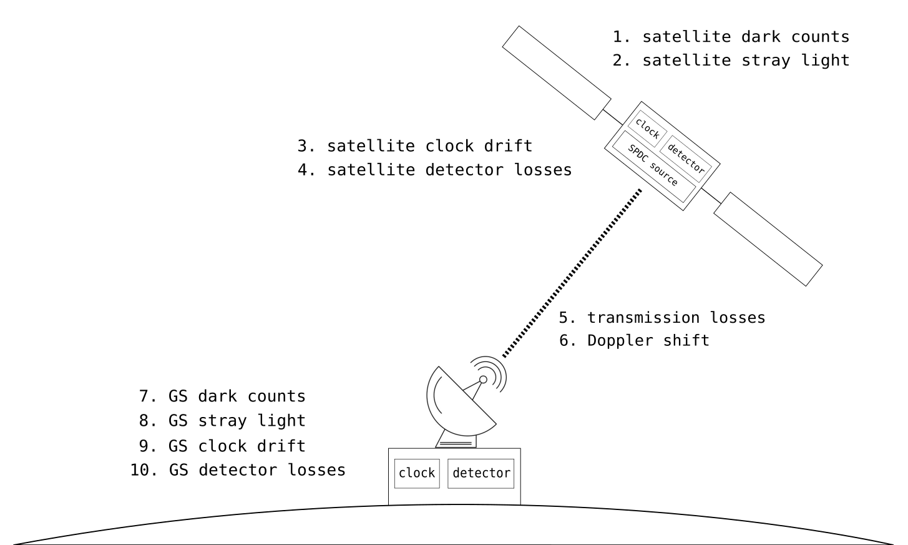

# event_generation

library to simulate photon generation events from SPDC source on satellite, accounting for the losses and distortions that happen during transmission and detection at the ground station. this experiment uses SPDC type-0, collinear, non-degenerate phase matching.

TODO: eavesdropping
TODO: dead time intrinsic to time tagger

## parameters

### source
- pair generation rate: `gen_rate` (~ 16-20 million counts / second)
- duration of simulation: `duration`

### detectors
- no. of detectors: `n_detector` (usually 4 or 5)
- detector efficiency: `eta_i`, i = 1, ..., `n_detector` (~0.25)
- skew parameter for each detector: `skew_i`, i = 1, ..., `n_detector`
- detector dead times: `dead_i`,  i = 1, ..., `n_detector` (~1ns)

### clocks
- timestamp resolution: `tau_res` (~1/8ns)
- coincidence window: `tau` (~2ns)
- clock drift: `drift_Alice`, `drift_Bob` 
- clock drift rate: `drift_rate_Alice`, `drift_rate_Bob`

### environment
- transmission loss: `transmission_loss` (~40 - 60 dB)
- dark count rates: `dark_Alice`, `dark_Bob` (accounts for stray light as well)

## metadata
- two-line element (TLE) of satellite
- saved pass (latitude, longitude, angle of elevation, start time, end time)

## data structures
- 49 bits time (UNIX time + appended internal clock time)
- encode detector clicks in two bits: first bit is basis, second bit is data
- we encode a pattern as a string of integers drawn from {1, ..., `n_detector`}, where the integer is the index of the detector that fired.
	- e.g. when `n_detector = 4`, we have `0,1` representing `|H>,|V>` in the HV basis, and `2,3` representing `|A>,|D>` in the AD basis.

## data generation algorithm
1. using `g`, generate `timestamps` following a Poissonian distribution. 
2. make two copies of `timestamps`, `timestamps_Alice` and `timestamps_Bob`.

### `Alice`
3. introduce dark counts and stray light (i.e. additional events) in `timestamps_Alice` using `dark_Alice`
4. randomly assign each event in `timestamps_Alice` to a detector, to form `pattern_Alice`
5. for each of Alice's detectors, drop a fraction of events at random according to the detector's efficiency, `eta_i`
6. for each of Alice's detectors, add a delay according to the detector's skew, `skew_i`
7. for each of Alice's detectors, remove any event that occurs less than `dead_i` after the previous event
8. stretch and squeeze `timestamps_Alice` using `drift_Alice` and `drift_rate_Alice`

### `Bob`
9. in `timestamps_Bob`, drop a fraction of events at random according to `transmission_loss`
10. introduce a Doppler shift on `timestamps_Bob` using the TLE and saved pass metadata
11. introduce dark counts and stray light (i.e. additional events) in `timestamps_Bob` using `dark_Bob`
12. randomly assign each event in `timestamps_Bob` to a detector, to form `pattern_Bob`
13. for each of Bob's detectors, drop a fraction of events at random according to the detector's efficiency, `eta_i`
14. for each of Bob's detectors, add a delay according to the detector's skew, `skew_i`
15. for each of Bob's detectors, remove any event that occurs less than `dead_i` after the previous event
16. stretch and squeeze `events_Bob` using `drift_Bob` and `drift_rate_Bob`