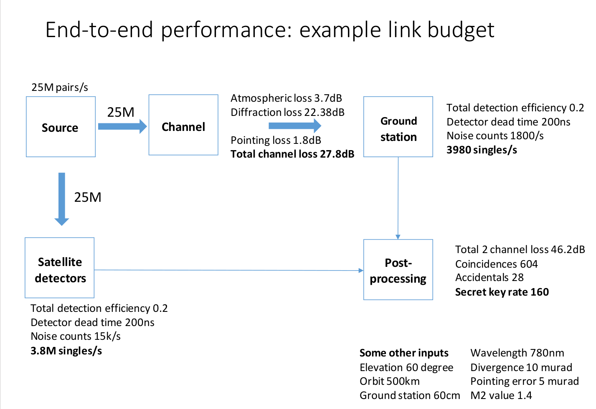

# event_generation

library to simulate photon generation events from SPDC source on satellite, accounting for the losses and distortions that happen during transmission and detection at the ground station. this experiment uses SPDC type-0, collinear, non-degenerate phase matching.

TODO: eavesdropping
TODO: dead time intrinsic to time tagger
TODO: QBER, sifting, key extraction
TODO: clock res, coincidence window

## parameters

### source
- pair generation rate: `gen_rate` (~ 16-20 million counts / second)
- duration of simulation: `duration` (~8 min / orbit)

### detectors
- no. of detectors: `n_detector` (usually 4 or 5)
- detector efficiency: `eta_i`, i = 1, ..., `n_detector` (~0.25)
- skew parameter for each detector: `skew_i`, i = 1, ..., `n_detector`
- detector dead times: `dead_i`,  i = 1, ..., `n_detector` (~200ns)

### clocks
- timestamp resolution: `tau_res` (~1/8ns)
- coincidence window: `tau` (~2ns)
- clock drift: `drift_Alice`, `drift_Bob` 
- clock drift rate: `drift_rate_Alice`, `drift_rate_Bob`

### environment
- transmission loss: `transmission_loss` (~ 28 dB)
- dark count rates: `dark_Alice`, `dark_Bob` (accounts for stray light as well)

## metadata
- two-line element (TLE) of cubesat; LEO (polar sun synchronous)
- saved pass (latitude, longitude, angle of elevation, start time, end time)

## data structures
- ~ 5GB of compressed downlink data per pass, 10 MB after losses (?)
- 49 bits time (UNIX time + appended internal clock time)
- encode detector clicks in two bits: first bit is basis, second bit is data
- we encode a pattern as a string of integers drawn from {1, ..., `n_detector`}, where the integer is the index of the detector that fired.
	- e.g. when `n_detector = 4`, we have `0,1` representing `|H>,|V>` in the HV basis, and `2,3` representing `|A>,|D>` in the AD basis.

## data generation algorithm
1. create `timestamps_Alice` with Poissonian distribution for Alice
2. randomly assign randomly assign each event in `timestamps_Alice` to a detector, to form `patterns_Alice`. zip these two datasets to form `events_Alice`
3. create a copy of `events_Alice` for Bob

### `Alice`
4. introduce dark counts and stray light (i.e. additional events) in `events_Alice` using `dark_Alice`
5. drop a fraction of `events_Alice` according to each detector's efficiency
6. add a delay in `events_Alice` according to each detector skew
7. for each of Alice's detectors, remove any event that occurs less than `dead_i` after the previous event
8. stretch and squeeze `events_Bob` using `drift_Alice` and `drift_rate_Alice`

### `Bob`
9. drop a fraction of events in events_Bob according to transmission_loss
10. introduce a Doppler shift on timestamps_Bob using the TLE and saved pass metadata
11. randomly select same or different bases for Bob, and assign detectors
12. introduce dark counts and stray light (i.e. additional events) in `timestamps_Bob` using `dark_Bob`
13. drop a fraction of events according to each detector efficiency
14. add a delay according to each detector skew
15. for each of Bob's detectors, remove any event that occurs less than `dead_i` after the previous event
16. stretch and squeeze `events_Bob` using `drift_Bob` and `drift_rate_Bob`
